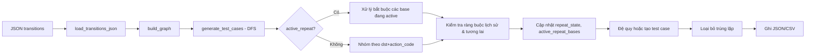

# 🧪 Test Case e2e Generator từ Decision Tree 

## 🧠 Tổng quan

`Test Case Generator` là công cụ tự động sinh **test case** từ một đồ thị chuyển trạng thái (decision tree) của chatbot, được mô tả dưới dạng JSON.  
Thay vì viết thủ công từng luồng hội thoại, công cụ này duyệt toàn bộ cây quyết định và tạo ra các test case bao gồm:

- Chuỗi các **customer intent** (ý định khách hàng) theo từng bước.
- **Bot response** mong đợi tương ứng.
- **Action code** kỳ vọng.
- Đường đi (path) qua các node.

Điểm đặc biệt: xử lý thông minh các **intent lặp** dạng `"hỏi số dư lần 1"`, `"hỏi số dư lần 2"`… và đảm bảo sinh đủ các chuỗi lặp theo đúng quy tắc nghiệp vụ.

---

## 📦 Cấu trúc dữ liệu đầu vào

### File JSON (danh sách các transition object)

Mỗi object đại diện cho một cạnh chuyển từ `step_no` → `next_step`, với các thuộc tính:

| Trường | Ý nghĩa |
|--------|---------|
| `step_no` | Node nguồn (ví dụ `"A1"`, `"B2"`) |
| `step_name` | Tên bước (mô tả) |
| `customer_intent` | Ý định khách hàng (ví dụ `"Kiểm tra số dư"`, `"Hỏi lãi suất lần 2"`) |
| `bot_response` | Phản hồi mong đợi của bot tại bước này |
| `next_step` | Node đích (`"End"` hoặc tên node khác) |
| `action_code` | Mã hành động kỳ vọng (ví dụ `"INQUIRY"`, `"TRANSFER"`) |

### Quy tắc đặc biệt

- **Node terminal**: `next_step` bằng `"End"`, `"stop"`, `"__end__"`, `"__terminal__"` (không phân biệt hoa thường).
- **Intent lặp**: Dạng `"hỏi lãi suất lần 2"` – được nhận diện bởi regex `(?i)\blần\s*(\d+)\b`.  
  - `"lần 1"`, `"lần 2"`, … phải đi tuần tự và **không được nhảy cóc**.
  - Khi ở node có intent `"lần N"`, nếu tồn tại transition với `"lần N+1"` từ chính node đó, thì **bắt buộc** phải đi tiếp đến `N+1` trước khi xử lý các intent khác (quy tắc "repeat chain bắt buộc").
- **Delimiter ghép nhiều intent**: Trong một bước (một node) có thể có nhiều transition cùng `next_step` và `action_code`. Các intent được ghép bằng dấu ` \ ` (backslash có khoảng trắng hai bên) để tạo thành một `step_intent` duy nhất.  
  Ví dụ: `"Kiểm tra số dư \ Hỏi lãi suất"` – nghĩa là tại node đó, bot có thể xử lý đồng thời cả hai intent.

---

## 🏗️ Các thành phần chính

### 1. Dataclass `Transition`
```python
@dataclass(frozen=True)
class Transition:
    src: str
    dst: str
    intent: str
    action_code: str
    bot_response: str
```
Lưu trữ một cạnh của đồ thị.

### 2. Hàm tiện ích

| Hàm | Mô tả |
|-----|-------|
| `_clean_str(v)` | Loại bỏ khoảng trắng, chuyển `"nan"` (không phân biệt hoa thường) thành chuỗi rỗng. |
| `_is_terminal_step(step_no)` | Kiểm tra xem node có phải là terminal (`"End"`, `"stop"`, …) hay không. |
| `_parse_repeat(intent)` | Trích xuất `(base_intent, n)` từ `"hỏi lãi suất lần 2"` → `("hỏi lãi suất", 2)`. Trả về `None` nếu không phải dạng lặp. |
| `_has_next_repeat(graph, node, base, n)` | Kiểm tra từ `node` có tồn tại transition với intent `f"{base} lần {n+1}"` không. |
| `_can_append_step(path_steps, new_step_intent)` | **Ràng buộc lịch sử**: Kiểm tra nếu `new_step_intent` có chứa `"lần N"` với `N > 1` thì trong `path_steps` đã từng xuất hiện `"lần N-1"` chưa. Ngăn việc xuất hiện `lần 2` mà không có `lần 1` trong cùng chuỗi. |
| `_can_append_step_with_repeat_rule(...)` | **Ràng buộc tương lai**: Khi đang ở một node và muốn chuyển tiếp, nếu intent hiện tại là `"lần N"` và tồn tại `"lần N+1"` từ node này, thì bắt buộc bước tiếp theo phải chứa `"lần N+1"` (nếu không sẽ bị từ chối). |

### 3. `load_transitions_json(path)`
Đọc file JSON, làm sạch các trường, trả về list of dict.

### 4. `build_graph(transitions)`
Xây dựng adjacency list: `Dict[str, List[Transition]]`.  
Mỗi node nguồn ánh xạ tới danh sách các `Transition` (đã sắp xếp theo `dst`, `action_code`, `intent`).

---

## 🧭 Sinh test case: `generate_test_cases()`

Đây là trái tim của công cụ. Sử dụng **DFS (Depth‑First Search)** để duyệt tất cả các đường đi hợp lệ từ node gốc (`root`), tuân thủ các quy tắc:

### Các tham số của DFS
- `node`: node hiện tại.
- `steps`: danh sách các `step_intent` đã đi qua (mỗi phần tử là chuỗi intent ghép bằng ` \ `).
- `bot_responses_list`: danh sách các **danh sách bot response** tương ứng mỗi bước (vì một bước có thể có nhiều intent → nhiều bot response).
- `path_nodes`: danh sách các node đã qua (dùng để tạo chuỗi `path`).
- `visited_pairs`: tập các cặp `(src, dst)` đã duyệt để tránh lặp vô hạn (chỉ áp dụng cho cạnh không phải self‑loop).
- `repeat_state`: dictionary lưu `(node, base_intent) -> n` lớn nhất đã gặp.
- `node_visit_count`: số lần thăm mỗi node (dự phòng).
- `active_repeat_bases`: tập các `base_intent` đang trong chuỗi lặp bắt buộc.
- `current_repeat_numbers`: số `n` hiện tại của mỗi `base` đang active.

### Luồng xử lý chính

#### 🔁 **Pha 1: Xử lý active repeat chain (bắt buộc)**
Nếu `active_repeat_bases` không rỗng, nghĩa là ở bước trước chúng ta vừa xử lý một intent `"lần N"` và có tồn tại `"lần N+1"` từ node hiện tại.  
Khi đó:
- Tìm tất cả transition có intent `base lần N+1` cho mỗi base trong active set.
- Nhóm chúng theo `(dst, action_code)`.
- **Chỉ xử lý các nhóm này**, bỏ qua mọi transition khác (kể cả terminal). Điều này đảm bảo chuỗi lặp được tiếp tục mà không bị cắt ngang.
- Nếu một nhóm có `dst` là terminal → tạo test case kết thúc.
- Nếu không terminal → tiếp tục DFS với `active_repeat_bases` được cập nhật (có thể thêm base mới nếu `"lần N+1"` lại có `N+2`).

#### 🌿 **Pha 2: Xử lý bình thường (không có active repeat)**
- Phân loại transition thành `terminal_transitions` (đích là terminal) và `non_terminal_transitions`.
- **Nhóm các transition** theo cặp `(dst, action_code)`:
  - Tại sao? Vì nhiều intent khác nhau có thể dẫn đến cùng một node đích và cùng action code → chúng có thể được gộp thành một bước duy nhất trong test case (bot xử lý đồng thời).
- Với mỗi nhóm:
  - Lấy tập hợp các intent → ghép bằng ` \ `.
  - Lấy tập hợp các bot response (giữ thứ tự xuất hiện).
  - Kiểm tra `_can_append_step` để đảm bảo tính tuần tự của các `lần N`.
  - Xác định các intent lặp trong nhóm:
    - Nếu có intent `"lần N"` và `N == repeat_state.get((node, base), 0) + 1` → cập nhật `repeat_state`.
    - Nếu `_has_next_repeat` đúng → thêm `base` vào `active_repeat_bases` cho lần DFS kế tiếp.
    - Nếu trong nhóm có **bất kỳ intent không lặp** → reset `active_repeat_bases` (vì chuỗi lặp bị phá vỡ).
  - Xử lý self‑loop (node == dst): cho phép đi tiếp nhưng đánh dấu `visited_pairs` để tránh lặp vô hạn (tuy nhiên self‑loop chỉ xảy ra với repeat chain, đã được xử lý riêng).
  - Đối với cạnh thường: nếu cặp `(node, dst)` đã từng gặp trong cùng nhánh thì bỏ qua (tránh cycle vô tận).
- Với mỗi nhóm terminal → tạo test case ngay (không cần DFS tiếp).

### Điều kiện dừng
- Đạt `max_depth` (mặc định 200) – phòng trường hợp đồ thị có vòng lặp vô hạn không được phát hiện.
- Không còn transition nào phù hợp.

### Loại bỏ trùng lặp
Sau khi sinh tất cả các đường đi, lọc bỏ các test case trùng nhau dựa trên `(tuple(steps), expected_action_code)`.

---

## 📤 Xuất kết quả

### JSON
```json
[
  {
    "tc_id": "TC001",
    "steps": ["Kiểm tra số dư", "Hỏi lãi suất lần 1 \\ Hỏi lãi suất lần 2"],
    "bot_responses": ["Số dư của bạn là 1M", "Lãi suất 5% \\ Lãi suất 6%"],
    "expected_action_code": "INQUIRY",
    "path": "A1 -> B2 -> End"
  }
]
```

### CSV
| tc_id | path | expected_action_code | step_1 | step_2 | bot_response_1 | bot_response_2 |
|-------|------|----------------------|--------|--------|----------------|----------------|
| TC001 | A1 → B2 → End | INQUIRY | Kiểm tra số dư | Hỏi lãi suất lần 1 \ Hỏi lãi suất lần 2 | Số dư của bạn là 1M | Lãi suất 5% \ Lãi suất 6% |

---

## 🧩 Ví dụ minh họa cách hoạt động

### Đồ thị đơn giản
```
A1 --(intent="Hỏi số dư", action="INQ", dst="B1")--> B1
B1 --(intent="Hỏi số dư lần 1", action="INQ", dst="B2")--> B2
B2 --(intent="Hỏi số dư lần 2", action="INQ", dst="End")--> End
B1 --(intent="Cảm ơn", action="THANKS", dst="End")--> End
```

### Sinh test case
- Từ A1: nhóm `(B1, INQ)` → bước 1: `"Hỏi số dư"`, đi đến B1.
- Tại B1: có hai nhóm:
  - Nhóm terminal `(End, THANKS)` → tạo test case ngắn: `["Hỏi số dư", "Cảm ơn"]`.
  - Nhóm non‑terminal `(B2, INQ)` → intent `"Hỏi số dư lần 1"`.  
    Kiểm tra `_has_next_repeat(B1, "Hỏi số dư", 1)` → true (vì có `lần 2` từ B1).  
    Do đó `active_repeat_bases` = `{"Hỏi số dư"}`.  
    Khi DFS sang B2, ở pha 1 sẽ bắt buộc chọn intent `"Hỏi số dư lần 2"` (vì active).  
    Từ B2, `lần 2` dẫn đến End → tạo test case đầy đủ 3 bước.

**Kết quả**:
- TC1: `["Hỏi số dư", "Cảm ơn"]`
- TC2: `["Hỏi số dư", "Hỏi số dư lần 1", "Hỏi số dư lần 2"]`

Đúng như kỳ vọng: không sinh ra đường đi `["Hỏi số dư", "Hỏi số dư lần 1", "Cảm ơn"]` vì quy tắc repeat chain bắt buộc đã ngăn cản.

---

## 🔧 Các quy tắc quan trọng (tóm tắt)

| Quy tắc | Mô tả | Được thực thi bởi |
|---------|-------|-------------------|
| **Ghép intent cùng đích và action** | Nhiều intent cùng `(dst, action_code)` được gộp thành một bước | Nhóm trong DFS |
| **Tuần tự lặp** | Không được xuất hiện `lần N` nếu chưa có `lần N-1` trong lịch sử | `_can_append_step` |
| **Bắt buộc tiếp tục lặp** | Nếu từ node hiện tại có `lần N+1`, bạn **phải** đi tiếp đến `N+1` trước khi làm gì khác | `active_repeat_bases` + pha 1 |
| **Tránh cycle không lặp** | Không đi qua cùng một cặp `(src, dst)` hai lần trong cùng nhánh (trừ self‑loop) | `visited_pairs` |
| **Delimiter** | Dùng ` \ ` để ghép intent và bot response | `join` với `" \\ "` |

---

## 📁 Cấu trúc đầu ra

Mặc định lưu vào file chỉ định bởi `--out`.  
Nếu không có `--out`, in JSON ra stdout.  
Hỗ trợ hai định dạng: `json` và `csv`.

- **JSON**: danh sách object, mỗi object có `tc_id`, `steps`, `bot_responses` (list string), `expected_action_code`, `path`.
- **CSV**: các cột `step_1, step_2, ...` và `bot_response_1, bot_response_2, ...` với số cột bằng độ dài test case dài nhất.

---

## 🧠 Tóm tắt luồng xử lý tổng thể



---

## 💡 Kết luận

Công cụ này tự động hóa việc sinh test case từ đồ thị chuyển trạng thái của chatbot, đảm bảo:

- **Bao phủ** tất cả các luồng hội thoại hợp lệ.
- **Xử lý đúng** các intent lặp theo đúng quy tắc nghiệp vụ (không bỏ sót chuỗi lặp, không sinh đường đi sai).
- **Gộp intent** giúp test case ngắn gọn nhưng vẫn đầy đủ.
- **Đầu ra đa dạng** (JSON/CSV) dễ dùng cho các hệ thống kiểm thử tự động.

Nhờ vậy, QA có thể tiết kiệm hàng giờ viết tay test case và tập trung vào việc phân tích kết quả.